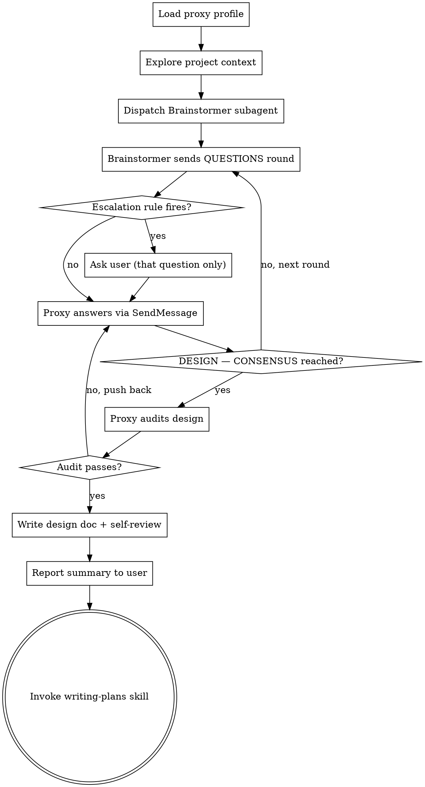

# Brainstorming Ideas Into Designs (Agent-Team Mode)

Turn ideas into fully formed designs through an **agent-to-agent dialogue**, not a user interrogation. The main agent becomes the **Proxy** — it answers design questions on the user's behalf using the persona in `skills/brainstorming/proxy-profile.md`. A **Brainstormer** subagent plays the role this skill used to play: it explores context, asks clarifying questions, proposes approaches, and converges on a design — except its questions go to the Proxy, and the two go back and forth until consensus.

The user is interrupted only when an Escalation Rule fires (executive decisions, explicitly reserved scenarios, licensing, open-source vs paid, and UI/UX design decisions — see proxy-profile.md). UI decisions always belong to the user, and when they're visual in nature they are shown via the visual companion rather than described in text.

<HARD-GATE>
Do NOT invoke any implementation skill, write any code, scaffold any project, or take any implementation action until the dialogue has reached DESIGN — CONSENSUS and the spec has been written. This applies to EVERY project regardless of perceived simplicity.
</HARD-GATE>

## Anti-Pattern: "This Is Too Simple To Need A Design"

Every project goes through this process. A todo list, a single-function utility, a config change — all of them. "Simple" projects are where unexamined assumptions cause the most wasted work. For truly simple projects the dialogue may be one round and the design a few sentences — but it MUST happen.

## Anti-Pattern: "I'll Just Answer My Own Questions Inline"

The Proxy and the Brainstormer must be different agents. If the same context both asks and answers, you get confirmation of your first idea, not a brainstorm. Always dispatch a real subagent.

## Checklist

You MUST create a task for each of these items and complete them in order:

1. **Load the proxy profile** — read `skills/brainstorming/proxy-profile.md`; you are now the Proxy
2. **Explore project context** — check files, docs, recent commits (share findings in the dispatch prompt, or tell the Brainstormer to explore itself)
3. **Dispatch the Brainstormer** — fill in `skills/brainstorming/brainstormer-prompt.md` and spawn it via the Agent tool
4. **Run the dialogue loop** — answer each QUESTIONS round as the Proxy via SendMessage; escalate to the user ONLY when an Escalation Rule fires
5. **Audit the consensus design** — check it against the proxy profile's decision rules before accepting
6. **Write design doc** — save to `docs/specs/YYYY-MM-DD-<topic>-design.md` and commit
7. **Spec self-review** — inline check for placeholders, contradictions, ambiguity, scope (see below)
8. **Report and proceed** — post a brief summary to the user (no approval gate), then invoke the writing-plans skill immediately; the pipeline continues through planning straight into implementation without pausing

## Process Flow

**The terminal state is invoking writing-plans.** Do NOT invoke frontend-design, mcp-builder, or any other implementation skill. The ONLY skill you invoke after brainstorming is writing-plans.

**The pipeline does not pause after planning either.** writing-plans hands off directly into execution (subagent-driven-development, or executing-plans without subagent support). Brainstorm → spec → plan → implementation runs as one continuous flow; the only stops are Escalation Rules firing, genuine blockers, or the user having explicitly asked to review the spec or plan.

## The Dialogue Protocol

**Dispatching:**

- Fill in the template at `skills/brainstorming/brainstormer-prompt.md`: the idea verbatim, the context you gathered, and `MAX_ROUNDS` (default 8; 3 for trivially scoped work).
- Spawn one Brainstormer with the Agent tool. Its final message each turn is its round; reply with SendMessage to the same agent so it keeps full dialogue context. Never spawn a fresh Brainstormer mid-dialogue — context loss resets the brainstorm.

**Answering as the Proxy:**

- Answer every question with a decision AND its rationale, grounded in the proxy profile: least tech debt first, then product/UX impact, then quality/scalability, then cost.
- Push back when the Brainstormer's recommendation violates the profile (adds debt, hurts UX, over-engineers). Concede when its argument is better. This friction is the point.
- Keep a running **dialogue log** (question → decision → rationale) — you will need it for the spec's decisions section.
- If you genuinely don't know a fact the question depends on (e.g., "does the API support X?"), go find out (read code, check docs) rather than guessing or bothering the user.

**Escalating to the user:**

- Before answering each question, check it against the Escalation Rules in proxy-profile.md. Licensing, open-source-vs-paid, and UI/UX design decisions are mechanical triggers; "executive decision" requires judgment — reserve it for genuinely high-profile calls you cannot safely make.
- Surface only the escalated question, with minimal context and concrete options. Continue the rest of the dialogue if it can proceed without the answer.
- **UI decisions get the visual treatment:** when the escalated question is about something the user would see (layouts, mockups, visual direction, navigation), follow the "UI escalations" section of proxy-profile.md — offer the visual companion and show the options rather than describing them. Conceptual product questions still go through the terminal.

**Optional specialist consultants:**

- When a round exposes a genuine fork with deep trade-offs (e.g., two architectures with non-obvious scaling behavior), the Proxy MAY spawn 2–3 parallel specialist subagents (architecture, product/UX, operations) to argue the options, then decide using their input.
- This is for hard forks only. Most questions the Proxy answers directly.

**Consensus and audit:**

- The dialogue ends when the Brainstormer outputs `DESIGN — CONSENSUS`.
- Before accepting, audit the design against the proxy profile: modular boundaries? least-debt path chosen? product/UX considered? SOLID respected? anything gold-plated that YAGNI should cut? If the audit fails, send the objections back via SendMessage and continue.
- If the Brainstormer outputs `DESIGN — BLOCKED`, resolve the open items yourself (research, escalate if an Escalation Rule applies) and send the resolutions back.

## Design for Isolation and Clarity

- Break the system into smaller units that each have one clear purpose, communicate through well-defined interfaces, and can be understood and tested independently
- For each unit, you should be able to answer: what does it do, how do you use it, and what does it depend on?
- Can someone understand what a unit does without reading its internals? Can you change the internals without breaking consumers? If not, the boundaries need work.
- Smaller, well-bounded units are also easier for you to work with - you reason better about code you can hold in context at once, and your edits are more reliable when files are focused. When a file grows large, that's often a signal that it's doing too much.

## Working in Existing Codebases

- Explore the current structure before proposing changes. Follow existing patterns.
- Where existing code has problems that affect the work (e.g., a file that's grown too large, unclear boundaries, tangled responsibilities), include targeted improvements as part of the design - the way a good developer improves code they're working in.
- Don't propose unrelated refactoring. Stay focused on what serves the current goal.

## After Consensus

**Documentation:**

- Write the validated design (spec) to `docs/specs/YYYY-MM-DD-<topic>-design.md`
  - (User preferences for spec location override this default)
- Include the Decisions log and Rejected alternatives from the dialogue, plus any user-escalated decisions marked as such
- Use elements-of-style:writing-clearly-and-concisely skill if available
- Commit the design document to git

**Spec Self-Review:**
After writing the spec document, look at it with fresh eyes:

1. **Placeholder scan:** Any "TBD", "TODO", incomplete sections, or vague requirements? Fix them.
2. **Internal consistency:** Do any sections contradict each other? Does the architecture match the feature descriptions?
3. **Scope check:** Is this focused enough for a single implementation plan, or does it need decomposition?
4. **Ambiguity check:** Could any requirement be interpreted two different ways? If so, pick one and make it explicit.

Fix any issues inline. No need to re-review — just fix and move on.

**Report and proceed (NO user approval gate):**

Post a concise summary to the user — what was designed, the key decisions and why, anything that was escalated and how it resolved, and the spec path — then invoke the writing-plans skill immediately. Do NOT wait for approval.

**Exception:** if the user has explicitly asked to review the design or the spec (in this conversation or their instructions), stop after the report and wait for their review before invoking writing-plans. Their explicit request always wins.

## Key Principles

- **Batch questions agent-to-agent** — up to 4 per round; no human is being overwhelmed
- **Decide, don't defer** — the Proxy escalates only on Escalation Rules, never for comfort
- **Rationale with every answer** — undocumented decisions can't be audited or defended
- **YAGNI ruthlessly** — remove unnecessary features from all designs
- **Explore alternatives** — the Brainstormer must propose 2-3 approaches before settling
- **Friction is a feature** — Proxy and Brainstormer are supposed to disagree; consensus earned through pushback beats first-idea agreement
- **User overrides everything** — if the user asks for interactive brainstorming or review gates, give them exactly that

## Visual Companion (for UI escalations)

The browser-based visual companion (`skills/brainstorming/visual-companion.md`) is a tool for showing mockups and diagrams **to a human**. In agent-team mode the human enters the loop exactly when a UI/UX escalation fires — and that is when the companion earns its keep.

- **Offer it just-in-time**, not upfront: the first time an escalated UI question would genuinely be clearer shown than described, offer the companion as its own message. On approval, start the server with `--open` and present the options visually (side-by-side mockups, wireframes, navigation diagrams).
- **Per-question test still applies:** a question about a UI *topic* is not automatically a visual question. "Which dashboard layout?" → browser. "Should admins see billing at all?" → terminal.
- If the user declines the companion, continue escalating UI decisions through the terminal with AskUserQuestion and don't offer again unless they raise it.
- Read `skills/brainstorming/visual-companion.md` before starting it.
- Never start the companion for Proxy↔Brainstormer dialogue — it exists for the user, not for agents.
