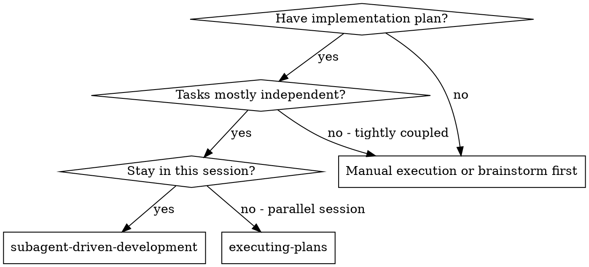
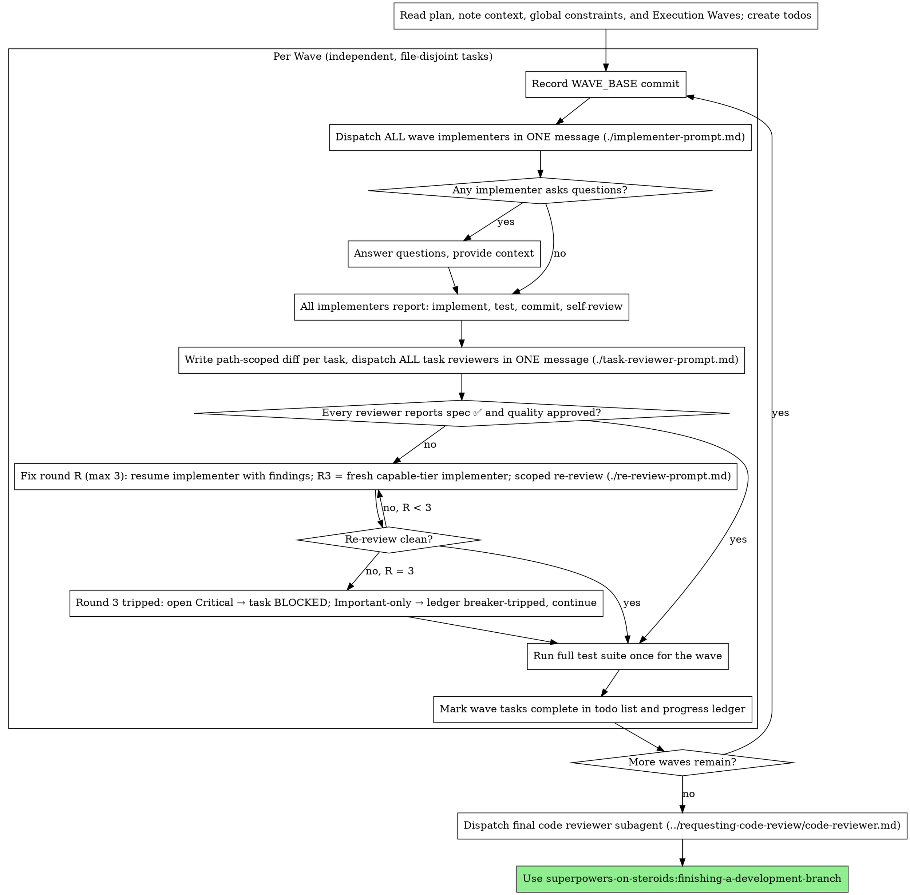

# Subagent-Driven Development

Execute plan by dispatching a fresh implementer subagent per task — in parallel waves of independent, file-disjoint tasks — a task review (spec compliance + code quality) after each, and a broad whole-branch review at the end.

**Why subagents:** You delegate tasks to specialized agents with isolated context. By precisely crafting their instructions and context, you ensure they stay focused and succeed at their task. They should never inherit your session's context or history — you construct exactly what they need. This also preserves your own context for coordination work.

**Core principle:** Fresh subagent per task + parallel waves of independent tasks + task review (spec + quality) + broad final review = high quality, fast iteration. Wall-clock time scales with the number of waves, not the number of tasks.

**Narration:** between tool calls, narrate at most one short line — the
ledger and the tool results carry the record.

**Continuous execution:** Do not pause to check in with your human partner between tasks or between waves. Execute all tasks from the plan without stopping. The only reasons to stop are: BLOCKED status you cannot resolve, ambiguity that genuinely prevents progress, or all tasks complete. "Should I continue?" prompts and progress summaries waste their time — they asked you to execute the plan, so execute it.

## When to Use



**vs. Executing Plans (parallel session):**
- Same session (no context switch)
- Fresh subagent per task (no context pollution)
- Independent tasks run concurrently in waves (wall-clock scales with waves, not tasks)
- Review after each task (spec compliance + code quality), broad review at the end
- Faster iteration (no human-in-loop between tasks)

## The Process



## Wave-Based Parallel Execution

Tasks run in waves, not one at a time. A wave is a set of tasks that are
mutually independent (no dependency edges between them) AND file-disjoint
(no shared Create/Modify/Test files — one shared test file disqualifies).
Everything inside a wave runs concurrently; waves themselves run in order.

**Building waves:**
- Use the plan's Execution Waves map when present. If the plan lacks one,
  derive it from each task's "Depends on" line and file lists: a task
  joins the current wave only if every task it depends on is in an
  earlier, completed wave, and its file set is disjoint from every
  wave-mate's.
- Cap a wave at 4 implementers. Beyond that, integration risk and
  question-answering load grow faster than the wall-clock savings —
  split into two waves.
- When in doubt about a pair of tasks, serialize the pair. Doubt costs
  one wave; a wrong parallel guess costs a corrupted branch.

**Running a wave:**
1. Record the current commit as WAVE_BASE.
2. Run `scripts/task-brief` for each task, then dispatch ALL wave
   implementers in a single message so they run concurrently (see
   superpowers-on-steroids:dispatching-parallel-agents). Tell each
   implementer it is part of a parallel wave.
3. Answer implementer questions as they arrive — the others keep working.
4. When all report, generate ONE path-scoped review package per task that
   needs review (in fast mode apply the Review tier gate first — a
   transcription task with gate evidence needs no package):
   `scripts/review-package WAVE_BASE HEAD -- <task's files>`. The path
   filter keeps wave-mates' interleaved commits out of each task's diff.
5. Dispatch ALL task reviewers not closed by the gate in a single
   message — reviews are read-only, so they are always parallel-safe.
6. For every task with Critical/Important findings, run the **Fix Loop**
   below. Rounds run in parallel across tasks (their file sets are
   disjoint by construction); within one task, fix → re-review is serial.
7. Run the full test suite once, after every wave commit and fix has
   landed. This is where cross-task breakage surfaces; dispatch one fix
   subagent if it fails, and if the failure touches a transcription
   task's files, promote that task and review it before the wave closes.
8. Append a ledger line per completed task, then start the next wave.

**Failure isolation:** one BLOCKED task does not stall its wave-mates —
finish their reviews normally, then resolve the blocked task alone (more
context, better model, or a task split) before starting any wave that
depends on it.

**What never runs in parallel:**
- Two implementers whose file sets overlap
- A task and any task that consumes its Produces interface
- Wave N+1 before every wave-N task it depends on has passed review
- A single task's fix → re-review loop (the re-review needs the fix)

### Fix Loop

A task's review-fix cycle is bounded at three rounds. Count rounds per task.

**Rounds 1–2: resume.** Send the reviewer's Critical/Important findings to
the task's original implementer via SendMessage — it still holds the task
context and takes fewer turns than a fresh fixer re-deriving the diff. In
fast mode that is the same `superpowers-on-steroids:caveman-implementer`
agent. If the implementer is no longer addressable, dispatch a fresh fix
subagent on the same tier carrying the findings **and** the original brief
path — never skip silently, and note the fallback in the ledger.

**Round 3: escalate.** Dispatch a fresh implementer on the capable tier via
the inline [implementer-prompt.md](implementer-prompt.md) in both modes —
fast agents are model/effort-pinned and cannot be raised at dispatch. The
capable tier resolves from `capable=` in the `<SUPERPOWERS_CONFIG>` tier
models line when set, else the most capable model this harness offers.

**After every round: scoped re-review.** Generate a fix package
(`scripts/review-package FIX_BASE HEAD -- <task's files>`, where FIX_BASE is
the head the previous review saw) and dispatch
[re-review-prompt.md](re-review-prompt.md) on a cheap-to-mid tier — in fast
mode, `superpowers-on-steroids:caveman-reviewer` in re-review mode. The
re-review verdicts each finding `ADDRESSED | NOT ADDRESSED` and flags new
breakage in the fix diff only; it is not a fresh review. Before dispatching
it, confirm the fix report names the covering tests, the command run, and
its output.

**Round 3 trips.** If findings remain open after the round-3 re-review:
- Any open **Critical** → mark the task BLOCKED. Failure isolation applies:
  wave-mates finish, dependents wait, resolve per Handling Implementer
  Status (BLOCKED).
- Only **Important** open → append the findings to the ledger under a
  `breaker-tripped` marker and continue the wave. The final whole-branch
  review dispatch must name every `breaker-tripped` entry and triage each.
- Open **Minor** are dropped at trip; the final reviewer sees the diff.

Never accept a Critical finding by exhaustion, and never run a fourth round.

## Pre-Flight Plan Review

Before dispatching Task 1, scan the plan once for conflicts:

- tasks that contradict each other or the plan's Global Constraints
- anything the plan explicitly mandates that the review rubric treats as a
  defect (a test that asserts nothing, verbatim duplication of a logic block)

Present everything you find to your human partner as one batched question —
each finding beside the plan text that mandates it, asking which governs —
before execution begins, not one interrupt per discovery mid-plan. If the
scan is clean, proceed without comment. The review loop remains the net for
conflicts that only emerge from implementation.

If the session context carries a `<SUPERPOWERS_CONFIG>` block, state the
resolved policy once, before wave 1, in one line: `Mode: fast — transcription
tasks skip per-task review on green report evidence, judgment tasks reviewed;
fix loop capped at 3 rounds`, or `Mode: standard — every task reviewed; fix
loop capped at 3 rounds` when the block carries only tier models. With no
block, say nothing.

## Model Selection

Use the least powerful model that can handle each role to conserve cost and increase speed.

**Mechanical implementation tasks** (isolated functions, clear specs, 1-2 files): use a fast, cheap model. Most implementation tasks are mechanical when the plan is well-specified.

**Integration and judgment tasks** (multi-file coordination, pattern matching, debugging): use a standard model.

**Architecture and design tasks**: use the most capable available model.
The final whole-branch review is one of these — dispatch it on the most
capable available model, not the session default.

**Review tasks**: choose the model with the same judgment, scaled to the
diff's size, complexity, and risk. A small mechanical diff does not need the
most capable model; a subtle concurrency change does.

**Always specify the model explicitly when dispatching a subagent.** An
omitted model inherits your session's model — often the most capable and
most expensive — which silently defeats this section.

**Turn count beats token price.** Wall-clock and context cost scale with how
many turns a subagent takes, and the cheapest models routinely take 2-3× the
turns on multi-step work — costing more overall. Use a mid-tier model as the
floor for reviewers and for implementers working from prose descriptions.
When the task's plan text contains the complete code to write, the
implementation is transcription plus testing: use the cheapest tier for
that implementer. Single-file mechanical fixes also take the cheapest tier.
Scoped re-reviews of small fix diffs take a cheap-to-mid tier. The round-3
fix escalation in the Fix Loop takes the capable tier.

**Task complexity signals (implementation tasks):**
- Touches 1-2 files with a complete spec → cheap model
- Touches multiple files with integration concerns → standard model
- Requires design judgment or broad codebase understanding → most capable model

**Tier names resolve to concrete models.** If the session context carries a
`<SUPERPOWERS_CONFIG>` block with a `tier models:` line, use its mapping —
`cheap=`, `standard=`, and `capable=` name the model for each tier above. For
tiers the block does not name, and when there is no block at all, judge what
this harness offers. Config decides what each tier *is*; it never decides which
tier a task *needs* — that stays with the heuristics above, including the
mid-tier floor for reviewers.

## Fast Mode

If the session context carries a `<SUPERPOWERS_CONFIG>` block with `mode: fast`,
dispatch the bundled agents instead of pasting the inline templates:

| Role | Standard path | Fast path |
|---|---|---|
| Implementer | [implementer-prompt.md](implementer-prompt.md) | `superpowers-on-steroids:caveman-implementer` |
| Task reviewer | [task-reviewer-prompt.md](task-reviewer-prompt.md) | `superpowers-on-steroids:caveman-reviewer` |
| Final whole-branch review | [code-reviewer.md](../requesting-code-review/code-reviewer.md) | `superpowers-on-steroids:caveman-final-reviewer` |
| Fix rounds 1–2 | resume the implementer (contract in [implementer-prompt.md](implementer-prompt.md)) | resume `superpowers-on-steroids:caveman-implementer` |
| Re-review | [re-review-prompt.md](re-review-prompt.md) | `superpowers-on-steroids:caveman-reviewer` (re-review mode) |

Each agent carries its role contract in its own system prompt, so a fast
dispatch passes only the task-specific material: the brief path, the report
path, the review package path, interfaces from earlier tasks, and the global
constraints that bind the task. Do not paste the template body as well — that
duplicates the contract and throws away the context saving that is the point.

Roles with no agent counterpart stay on the template path in both modes: the
round-3 fix implementer (capable tier via the inline template), the
spec-document reviewer, the plan-document reviewer, and the Brainstormer.

Model selection is unchanged in fast mode — resolve the tier as always and pass
`model:` explicitly. Effort is fixed by each agent's definition and cannot be
raised at dispatch.

**Review tier gate.** Each plan task carries `**Review tier:** transcription |
judgment` (writing-plans). In fast mode, a `transcription` task skips
`review-package` and the task reviewer when the implementer's report **file**
(not the short reply) shows status DONE, the GREEN test command, and its
passing output — read the file to check. Ledger it as
`Task N: complete (wave W, commits <base7>..<head7>, transcription gate)`.
Promote the task to judgment — generate the package and dispatch the
reviewer as normal — on any of:

1. status ≠ DONE;
2. the report file lacks the GREEN command or its output;
3. the task's commits touch a file outside the brief's Files list
   (`git diff --stat WAVE_BASE HEAD -- <task's files>` vs `git diff --stat WAVE_BASE HEAD`);
4. the implementer reports a plumbing deviation from the brief's literal code;
5. the per-wave test suite fails on a test touching the task's files —
   promote retroactively and review before the wave closes.

A missing or malformed field is `judgment`. Never downgrade a tier the plan
set. Standard mode ignores the field: every task is reviewed.

## Handling Implementer Status

Implementer subagents report one of four statuses. Handle each appropriately:

**DONE:** In fast mode, apply the Review tier gate first (see Fast Mode) — a transcription task with gate evidence is complete here. Otherwise generate the review package (`scripts/review-package BASE HEAD`, from this skill's directory — it prints the unique file path it wrote; BASE is the commit you recorded before dispatching the implementer or the wave — never `HEAD~1`, which silently drops all but the last commit of a multi-commit task), then dispatch the task reviewer with the printed path. In a parallel wave, always add the task's path scope: `scripts/review-package WAVE_BASE HEAD -- <task's files>` — without it, wave-mates' interleaved commits pollute the diff.

**DONE_WITH_CONCERNS:** The implementer completed the work but flagged doubts. Read the concerns before proceeding. If the concerns are about correctness or scope, address them before review. If they're observations (e.g., "this file is getting large"), note them and proceed to review.

**NEEDS_CONTEXT:** The implementer needs information that wasn't provided. Provide the missing context and re-dispatch.

**BLOCKED:** The implementer cannot complete the task. Assess the blocker:
1. If it's a context problem, provide more context and re-dispatch with the same model
2. If the task requires more reasoning, re-dispatch with a more capable model. In fast mode, re-dispatch on the inline template path rather than the fast agent — its effort is pinned low and cannot be raised at dispatch.
3. If the task is too large, break it into smaller pieces
4. If the plan itself is wrong, escalate to the human

**Never** ignore an escalation or force the same model to retry without changes. If the implementer said it's stuck, something needs to change.

## Handling Reviewer ⚠️ Items

The task reviewer may report "⚠️ Cannot verify from diff" items — requirements
that live in unchanged code or span tasks. These do not block the rest of the
review, but you must resolve each one yourself before marking the task
complete: you hold the plan and cross-task context the reviewer
lacks. If you confirm an item is a real gap, treat it as a failed spec
review — send it back through the Fix Loop.

## Constructing Reviewer Prompts

Per-task reviews are task-scoped gates. The broad review happens once, at the
final whole-branch review. When you fill a reviewer template:

- Do not add open-ended directives like "check all uses" or "run race tests
  if useful" without a concrete, task-specific reason
- Do not ask a reviewer to re-run tests the implementer already ran on the
  same code — the implementer's report carries the test evidence
- Do not pre-judge findings for the reviewer — never instruct a reviewer to
  ignore or not flag a specific issue. If you believe a finding would be a
  false positive, let the reviewer raise it and adjudicate it in the review
  loop. If the prompt you are writing contains "do not flag," "don't treat X
  as a defect," "at most Minor," or "the plan chose" — stop: you are
  pre-judging, usually to spare yourself a review loop.
- The global-constraints block you hand the reviewer is its attention
  lens. Copy the binding requirements verbatim from the plan's Global
  Constraints section or the spec: exact values, exact formats, and the
  stated relationships between components ("same layout as X", "matches
  Y"). The reviewer's template already carries the process rules (YAGNI,
  test hygiene, review method) — the constraints block is for what THIS
  project's spec demands.
- Hand the reviewer its diff as a file: run this skill's
  `scripts/review-package BASE HEAD` and pass the reviewer the file path
  it prints (or, without bash: `git log --oneline`, `git diff --stat`,
  and `git diff -U10` for the range, redirected to one uniquely named
  file). The output never enters your own context, and the reviewer sees
  the commit list, stat summary, and full diff with context in one Read
  call. Use the BASE you recorded before dispatching the implementer —
  never `HEAD~1`, which silently truncates multi-commit tasks. In a
  parallel wave, append `-- <task's files>` so the package contains only
  this task's changes.
- A dispatch prompt describes one task, not the session's history. Do not
  paste accumulated prior-task summaries ("state after Tasks 1-3") into
  later dispatches — a real session's dispatch hit 42k chars of which 99%
  was pasted history. A fresh subagent needs its task, the interfaces it
  touches, and the global constraints. Nothing else.
- Run the Fix Loop for Critical and Important findings. Record Minor
  findings in the progress ledger as you go, and point the final
  whole-branch review at that list so it can triage which must be fixed
  before merge. A roll-up nobody reads is a silent discard.
- A finding labeled plan-mandated — or any finding that conflicts with
  what the plan's text requires — is the human's decision, like any plan
  contradiction: present the finding and the plan text, ask which governs.
  Do not dismiss the finding because the plan mandates it, and do not
  dispatch a fix that contradicts the plan without asking.
- The final whole-branch review gets a package too: run
  `scripts/review-package MERGE_BASE HEAD` (MERGE_BASE = the commit the
  branch started from, e.g. `git merge-base main HEAD`) and include the
  printed path in the final review dispatch, so the final reviewer reads
  one file instead of re-deriving the branch diff with git commands.
- Every fix round carries the implementer contract: the resumed (or
  fresh) implementer re-runs the tests covering its change and appends a
  fix report. Name the covering test files in the message — a one-line fix
  does not need the whole suite. Before dispatching the re-review, confirm
  the fix report contains the covering tests, the command run, and the
  output; dispatch the re-review once all three are present.
- If the final whole-branch review returns findings, dispatch ONE fix
  subagent with the complete findings list — not one fixer per finding.
  Per-finding fixers each rebuild context and re-run suites; a real
  session's final-review fix wave cost more than all its tasks combined.

## File Handoffs

Everything you paste into a dispatch prompt — and everything a subagent
prints back — stays resident in your context for the rest of the session
and is re-read on every later turn. Hand artifacts over as files:

- **Task brief:** before dispatching an implementer, run this skill's
  `scripts/task-brief PLAN_FILE N` — it extracts the task's full text to a
  uniquely named file and prints the path. Compose the dispatch so the
  brief stays the single source of requirements. Your dispatch should
  contain: (1) one line on where this task fits in the project; (2) the
  brief path, introduced as "read this first — it is your requirements,
  with the exact values to use verbatim"; (3) interfaces and decisions
  from earlier tasks that the brief cannot know; (4) your resolution of
  any ambiguity you noticed in the brief; (5) the report-file path and
  report contract. Exact values (numbers, magic strings, signatures, test
  cases) appear only in the brief.
- **Report file:** name the implementer's report file after the brief
  (brief `…/task-N-brief.md` → report `…/task-N-report.md`) and put it in
  the dispatch prompt. The implementer writes the full report there and
  returns only status, commits, a one-line test summary, and concerns.
- **Reviewer inputs:** the task reviewer gets three paths — the same brief
  file, the report file, and the review package — plus the global
  constraints that bind the task.
- Fix rounds append their fix report (with test results) to the same
  report file and return a short summary; re-reviews read the updated file.

## Durable Progress

Conversation memory does not survive compaction. In real sessions,
controllers that lost their place have re-dispatched entire completed task
sequences — the single most expensive failure observed. Track progress in
a ledger file, not only in todos.

- At skill start, check for a ledger:
  `cat "$(git rev-parse --show-toplevel)/.superpowers/sdd/progress.md"`. Tasks listed there
  as complete are DONE — do not re-dispatch them; resume at the first task
  not marked complete.
- When a task's review comes back clean, append one line to the ledger in
  the same message as your other bookkeeping:
  `Task N: complete (wave W, commits <base7>..<head7>, review clean)`.
- The ledger is your recovery map: the commits it names exist in git even
  when your context no longer remembers creating them. After compaction,
  trust the ledger and `git log` over your own recollection.
- `git clean -fdx` will destroy the ledger (it's git-ignored scratch); if
  that happens, recover from `git log`.

## Prompt Templates

- [implementer-prompt.md](implementer-prompt.md) - Dispatch implementer subagent
- [task-reviewer-prompt.md](task-reviewer-prompt.md) - Dispatch task reviewer subagent (spec compliance + code quality)
- [re-review-prompt.md](re-review-prompt.md) - Dispatch scoped re-review after a fix round (per-finding ADDRESSED / NOT ADDRESSED)
- Final whole-branch review: use superpowers-on-steroids:requesting-code-review's [code-reviewer.md](../requesting-code-review/code-reviewer.md)

In fast mode, substitute the bundled agents per the Fast Mode table above.

## Example Workflow

```
You: I'm using Subagent-Driven Development to execute this plan.

[Read plan file once: docs/plans/feature-plan.md]
[Note Execution Waves: Wave 1 = Tasks 1, 2 (independent, disjoint files);
 Wave 2 = Task 3 (depends on both)]
[Create todos for all tasks]

Wave 1: Task 1 (hook installation script) + Task 2 (recovery modes)

[Record WAVE_BASE]
[Run task-brief for Tasks 1 and 2; dispatch BOTH implementers in one
 message, each with its brief + report paths + context + "you are part
 of a parallel wave" note]

Implementer 1: "Before I begin - should the hook be installed at user or system level?"
You: "User level (~/.config/superpowers/hooks/)"
[Implementer 2 keeps working while you answer]

Implementer 1: Implemented install-hook command, 5/5 tests passing,
  self-review found missing --force flag and added it. Committed.
Implementer 2: Added verify/repair modes, 8/8 tests passing. Committed.

[Run review-package WAVE_BASE HEAD -- <Task 1 files>, and again with
 -- <Task 2 files>; dispatch BOTH task reviewers in one message]

Reviewer 1: Spec ✅ - all requirements met, nothing extra. Task quality: Approved.
Reviewer 2: Spec ❌:
  - Missing: Progress reporting (spec says "report every 100 items")
  - Extra: Added --json flag (not requested)
  Issues (Important): Magic number (100)

[Fix round 1: resume Implementer 2 with Reviewer 2's findings]
Implementer 2: Removed --json flag, added progress reporting, extracted
  PROGRESS_INTERVAL constant. Fix report appended, 9/9 tests passing.

[review-package FIX_BASE HEAD -- <Task 2 files>; dispatch scoped re-review]
Re-reviewer 2: Missing progress reporting — ADDRESSED. Extra --json — ADDRESSED.
  Magic number — ADDRESSED. New breakage: none. Fix round: all findings addressed.

[Run full test suite once for the wave — green]
[Ledger: Task 1 complete (wave 1), Task 2 complete (wave 1)]

Wave 2: Task 3 (integration — consumed Tasks 1 and 2 interfaces)

[Record new WAVE_BASE; single-task wave runs like the classic flow]
...

[After all waves]
[Dispatch final code-reviewer]
Final reviewer: All requirements met, ready to merge

Done!
```

## Advantages

**vs. Manual execution:**
- Subagents follow TDD naturally
- Fresh context per task (no confusion)
- Parallel-safe (subagents don't interfere)
- Subagent can ask questions (before AND during work)

**vs. Executing Plans:**
- Same session (no handoff)
- Continuous progress (no waiting)
- Review checkpoints automatic
- Parallel waves cut wall-clock time on plans with independent tasks

**Efficiency gains:**
- Controller curates exactly what context is needed; bulk artifacts move
  as files, not pasted text
- Subagent gets complete information upfront
- Questions surfaced before work begins (not after)

**Quality gates:**
- Self-review catches issues before handoff
- Task review carries two verdicts: spec compliance and code quality
- Review loops ensure fixes actually work
- Spec compliance prevents over/under-building
- Code quality ensures implementation is well-built

**Cost:**
- More subagent invocations (implementer + reviewer per task)
- Controller does more prep work (extracting all tasks upfront)
- Review loops add iterations
- But catches issues early (cheaper than debugging later)

## Red Flags

**Never:**
- Start implementation on main/master branch without explicit user consent
- Skip task review for a judgment task, or for a transcription task whose
  report file lacks the gate evidence; accept a report missing either
  verdict (spec compliance AND task quality are both required)
- Proceed with unfixed issues
- Dispatch implementers in parallel whose file sets overlap or where one
  consumes another's interface — same-wave tasks must be independent AND
  file-disjoint; that is what waves are for
- Serialize tasks the Execution Waves map marks independent — running a
  whole plan one task at a time wastes wall-clock time for no quality gain
- Generate a review package in a parallel wave without the
  `-- <task's files>` path filter (wave-mates' commits pollute the diff)
- Make a subagent read the whole plan file (hand it its task brief —
  `scripts/task-brief` — instead)
- Skip scene-setting context (subagent needs to understand where task fits)
- Ignore subagent questions (answer before letting them proceed)
- Accept "close enough" on spec compliance (reviewer found spec issues = not done)
- Skip review loops (reviewer found issues = implementer fixes = review again)
- Let implementer self-review replace actual review (both are needed)
- Tell a reviewer what not to flag, or pre-rate a finding's severity in the
  dispatch prompt ("treat it as Minor at most") — the plan's example code is
  a starting point, not evidence that its weaknesses were chosen
- Dispatch a task reviewer without a diff file — generate it first
  (`scripts/review-package BASE HEAD`) and name the printed path in the
  prompt
- Move to next task while the review has open Critical/Important issues
- Re-dispatch a task the progress ledger already marks complete — check
  the ledger (and `git log`) after any compaction or resume

**If subagent asks questions:**
- Answer clearly and completely
- Provide additional context if needed
- Don't rush them into implementation

**If reviewer finds issues:**
- Fix round 1–2: resume the same implementer with the findings
- Scoped re-review after every round (`re-review-prompt.md`); never skip it
- Round 3: fresh implementer on the capable tier
- Round 3 trips: open Critical → BLOCKED; Important-only → ledger
  `breaker-tripped` and continue; never a fourth round

**If subagent fails task:**
- Follow Handling Implementer Status (BLOCKED) — more context, capable
  tier, or a task split
- Don't try to fix manually (context pollution)

## Integration

**Required workflow skills:**
- **superpowers-on-steroids:using-git-worktrees** - Ensures isolated workspace (creates one or verifies existing)
- **superpowers-on-steroids:writing-plans** - Creates the plan this skill executes (including the Execution Waves map)
- **superpowers-on-steroids:dispatching-parallel-agents** - Mechanics of concurrent subagent dispatch for waves
- **superpowers-on-steroids:requesting-code-review** - Code review template for the final whole-branch review
- **superpowers-on-steroids:finishing-a-development-branch** - Complete development after all tasks

**Subagents should use:**
- **superpowers-on-steroids:test-driven-development** - Subagents follow TDD for each task

**Alternative workflow:**
- **superpowers-on-steroids:executing-plans** - Use for parallel session instead of same-session execution
